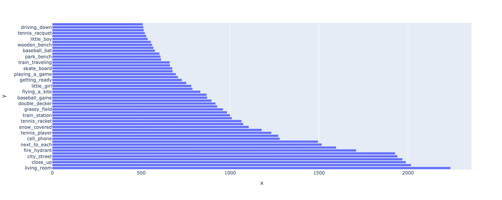

### Общие выводы
Всего у нас есть 49к наблюдений. 
Каждое наблюдение содержит:
* 5 предложений с описанием картинки
* список объектов 
* список атрибутов
* список отношений объектов
* список регионов (области картинки)

Самые часто встречающиеся описания - занятия спортом, городские пейзажи, интерьер, животные
#### Описательная аналитика
Доля стоп слов в корпусе  `55%` 
Средняя длина предложения со стоп-словами: `10-11`
Средняя длина предложения без стоп слов: `4`

Из частей речи чаще всего встречаются существительные и артикли.
Затем идут дополнения и глаголы. 

Тексты в корпусе описывают картинку, поэтому логично, что среди частей речи преобладают существительные.

### Частотный анализ, топ-слов
Самые популярные слова по встречаемости:
* человек (people, man, woman), street - в городском пейзаже часто есть улица
* train - возможно потому что много спорта и поездов) 
* standing, sitting - популярные глаголы состояний

При tf-idf анализе выделяются слова table и tennis. Если стол действительно популярный объект, то теннис выделяется на фоне остальных слов. Возможно, в корпусе слишком много описаний сцен тенниса или спорта в целом.

#### N-grams и коллокации
**Основные n-grams**
1. Состояние людей/предметов: sitting next, standing next, riding, playing, holding, hitting, flying

2. Описание людей/предметов: young man

3. Устойчивые названия: cell phone, teddy bear, living room

4. Пейзажи: snow covered slope, busy city street

**Основные коллакации это:**

1. Устойчивые выражения: cell phone, living room, train station, stop sign, clock tower, skate board, laptop computer,

2. Положение: next to each, clode up, that has

3. Пейзажи: city street, tennis court, blue sky, grassy area, snow covered

4. Персонажи: young boy, little girl, little boy, cat laying

5. Предметы: wooden bench, lush green, park bench

6. Действия: flying a kite, getting ready, playing a game, driving down

